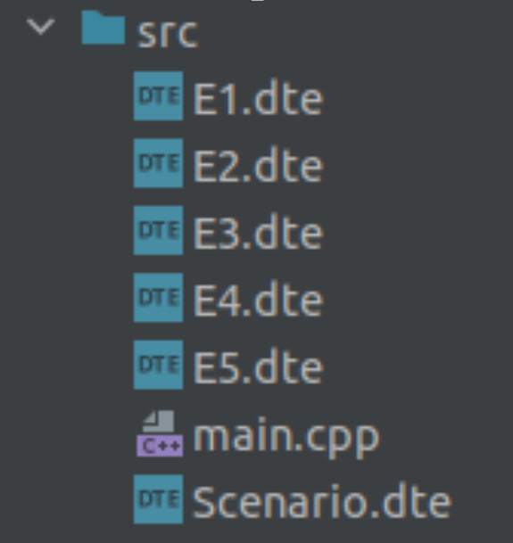
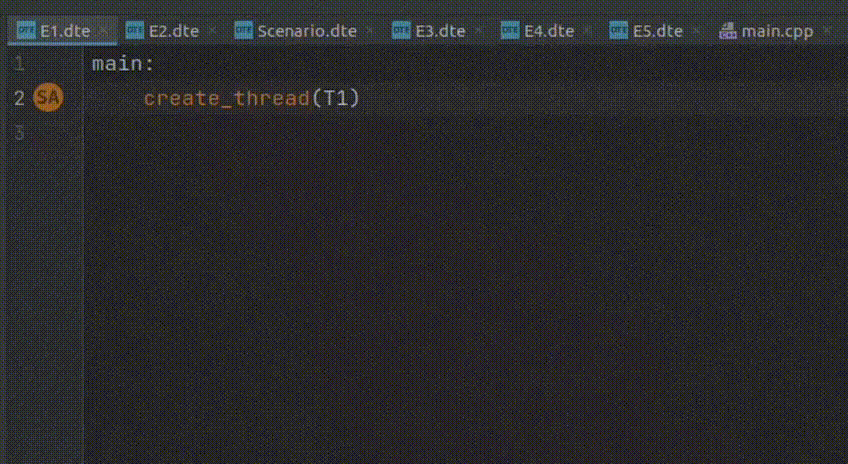

# deterministic-thread-execution-plugin
Plugin supports special kind of a DSL that helps to create deterministic execution of your multithreaded C++ programs via scenarios written in the DSL.

## Basic functionality:

- Syntax support and syntax highlightning
- DTE files support
- Basic static analysis features

## Demo

Here are *some* of the features demonstrated

### DTE files support

### Static analysis

## Possible next steps

I have some demo version of feature that supports matching between source C++ code and DSL synchronization actions, here is how it should look like

Hopefully, it will be implemented together with build configuration and decent DTE files integration with C++ projects. However, the date of this feature's release is unknown to the author.

